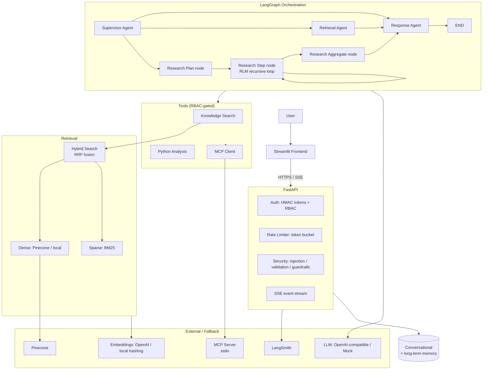

# Architecture

## High-level diagram

## Data flow for one turn

1. User message arrives at `POST /api/chat` with a bearer token.
2. **Auth** verifies the token and resolves the user + role.
3. **Input validation** checks length/control characters.
4. **Prompt-injection screening** blocks high-confidence injection attempts.
5. **Rate limiter** (per-user token bucket) admits or rejects the request.
6. The **LangGraph** supervisor classifies intent, decomposes the task and
   routes to the retrieval agent, the research (RLM) path, or straight to the
   response agent.
7. Each node emits typed events onto an in-process event bus; the API forwards
   them to the browser as **Server-Sent Events** (real-time activity panel).
8. Tools are executed through wrappers that enforce **RBAC + validation +
   timeout**, so authorization cannot be bypassed by agent reasoning.
9. The response agent applies **output guardrails** (hallucinated-citation
   filtering, PII/secret leak and brand-safety checks) before returning.
10. The turn is written to **memory** (short-term buffer + long-term store) and
    every step is recorded in **LangSmith** (and a local trace collector).

## Key design decisions

| Decision | Rationale |
| --- | --- |
| **LangGraph** orchestration | Native state graph, checkpointing, streaming — ideal for multi-agent, observable workflows. |
| **Supervisor + specialized agents** | Separation of concerns; each agent is testable and debuggable. |
| **RLM via a bounded recursive loop** | Explore → plan → targeted retrieval → re-query when saturated → aggregate. Avoids loading whole documents into context. |
| **Hybrid search + RRF** | Dense (semantic) + sparse (exact keywords) complement each other; RRF needs no training and is robust to score-scale differences. |
| **Local fallbacks everywhere** | Mock LLM, hashing embeddings, local index make the POC runnable with zero credentials and demonstrate graceful degradation. |
| **RBAC inside tool wrappers** | The role is bound at tool construction; the agent cannot ask for higher privileges. |
| **Deterministic temperature 0** | Auditable, reproducible agent behaviour for an enterprise setting. |
| **OpenAI-compatible LLM client** | One client works with OpenAI, Azure, Anthropic gateways and local Ollama/vLLM by changing `OPENAI_BASE_URL`. |

## Security model

**Prompt injection**
- Heuristic pre-screen (instruction override, prompt leak, exfiltration,
  tool abuse patterns).
- Retrieved content is wrapped in `<untrusted_document_content>` delimiters so
  documents cannot steer the model (indirect injection).
- Output re-validation catches leaks of the system prompt or secrets.

**Input validation**
- All requests and tool parameters validated against allow-lists with length
  caps and control-character rejection.

**Guardrails**
- Unsafe tool execution → restricted AST-allow-list Python analysis; RBAC.
- Unauthorized access → RBAC at tool wrapper + role-based access-level filters.
- Hallucinated citations → citation ids must exist in retrieved chunks.
- Invalid responses → empty/oversized/leak/brand-safety checks.

**Rate limiting** — token bucket per user, configurable capacity and refill.

**Authentication** — HMAC-signed, expiring bearer tokens; hardcoded users for
the POC (swap for Keycloak in production).

## Error handling & graceful degradation

| Failure | Behaviour |
| --- | --- |
| LLM unavailable / API error | Falls back to deterministic supervisor/template answers |
| Pinecone unavailable | Falls back to local vector store automatically |
| MCP server fails | Tool call returns a structured error; the research step records it and continues |
| Tool timeout | `asyncio.wait_for` + graceful `ToolResult(error=...)` |
| Invalid request | 400/401/403/429 with clear detail |

## Assumptions & trade-offs

- **Assumptions**
  - Single-process deployment for the POC (in-memory event bus, memory and
    graph checkpointers). Horizontal scaling would move these to Redis/Postgres.
  - Dummy enterprise data and sample documents are representative but fictional.
  - "Commercial bank" branding used as the bot's owning company.
- **Trade-offs**
  - Local hashing embeddings are lexically simple vs. transformer embeddings;
    they exist only to keep the demo offline. Set `OPENAI_API_KEY` for real
    embeddings.
  - Pinecone sparse search uses a local BM25 mirror rather than Pinecone
    sparse vectors (documented in `vector_store.py`); the local backend
    implements the full hybrid pipeline end-to-end.
  - The MCP server implements a minimal MCP stdio subset (tools/list,
    tools/call) rather than the full SDK protocol.
  - The restricted Python tool supports expressions, not arbitrary scripts, by
    design (security first).

## Model selection rationale

`gpt-4o-mini` is the default because it is cheap, fast and sufficient for
classification/summarisation tasks, while remaining swappable via the
OpenAI-compatible interface. Temperature is pinned to 0 for determinism.
